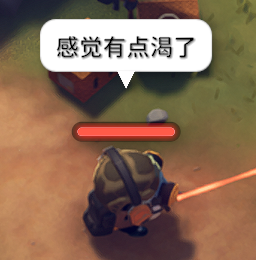

# StateNitifyByPop
[创意工坊地址](https://steamcommunity.com/sharedfiles/filedetails/?id=3599713506)

## 简介
使用角色气泡框提醒水分和能量状态，显示效果如下：

启动后会生成配置文件 `...\Escape from Duckov\Duckov_Data\StreamingAsset\StateNotifyByPop.cfg`，可自行调整提醒阈值（分别会在低于设定值，设定值一半和减为 0 时候进行提醒，也可以通过关闭第三个选项只在低于设定值时进行提醒）。